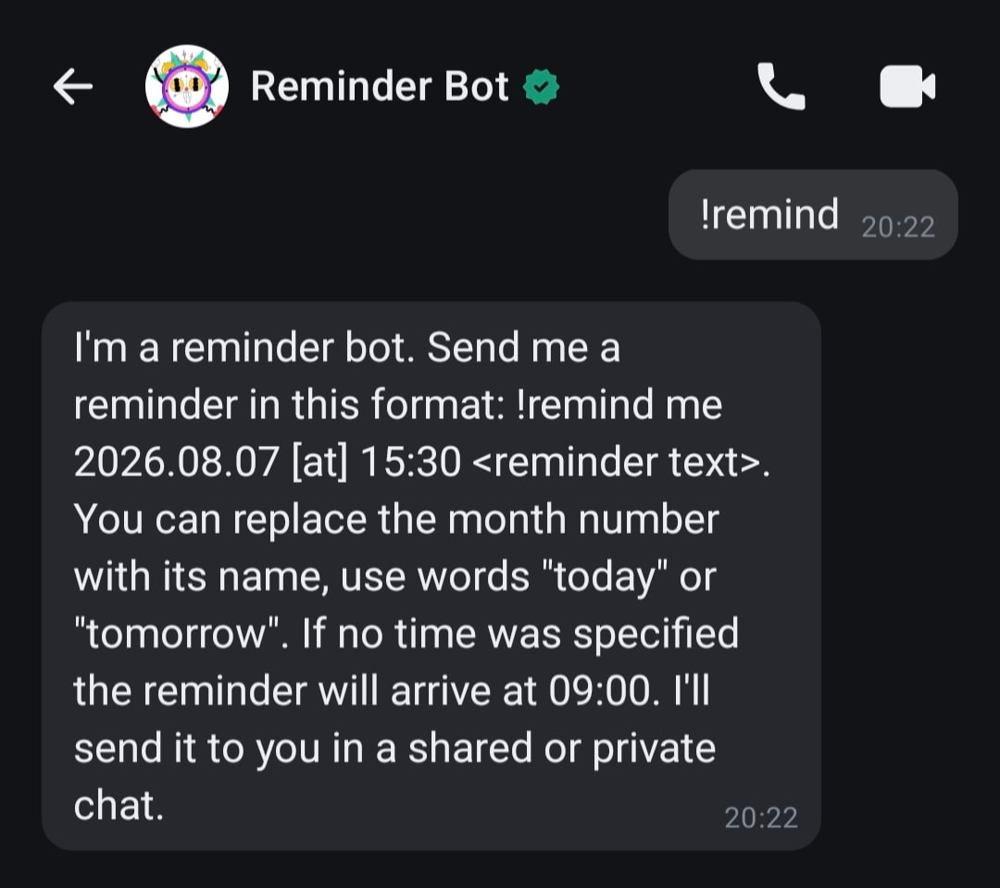
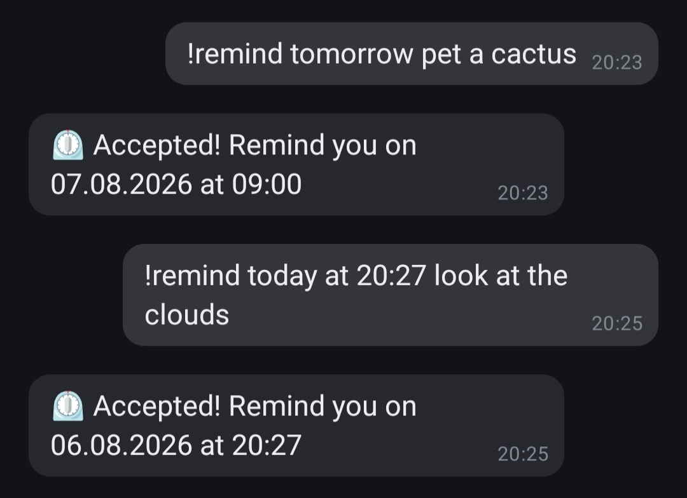
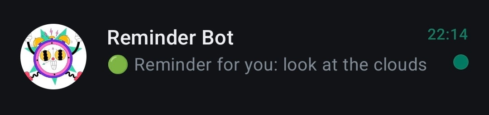
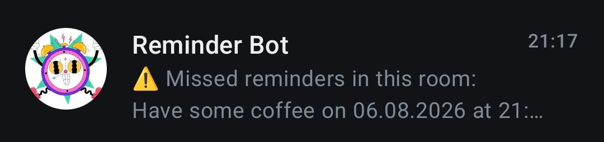
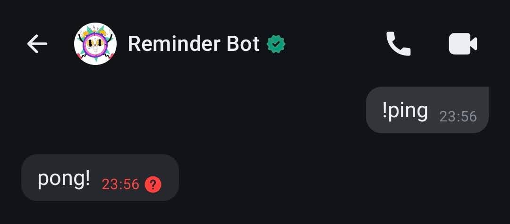

<p align="center">
	
</p>
<p align="center">
	<i>
		Logo credits:  <a href="https://www.flaticon.com/free-stickers/alarm-clock" title="alarm clock stickers">Alarm clock stickers created by Stickers - Flaticon</a>
	</i>
</p>
<br>

[](https://github.com/outarde/reminder-bot/blob/main/LICENSE) [](https://github.com/outarde/reminder-bot/actions) [](https://github.com/outarde/reminder-bot/releases) [](https://github.com/outarde/reminder-bot/commits/main/)

# Reminder Bot
A lightweight chatbot for reminders on Matrix servers focused on multilingual support and clear user experience. Schedule reminders on the go in personal or group rooms.
## Key Features
- ⏲️ Create reminders with the `/remind` command
- 📆 Basic date and time variability with the words `today`, `tomorrow`, `morning`, `afternoon`, `evening`, omitting the year and month
- 🔤 Multilingual support for user input and bot responses, with the capability to upload custom translations
- 📋 Send a summary of missed reminders in each room
- 🎹 Aliases for calling the bot and the ability to call the bot without a command or only by mention
## Matrix Account Features
- Login to the bot's Matrix account with a password and token, automatic device verification and backup if this is the first device for the account, and receiving a recovery key
- Manual verification with a recovery key if the bot account has been logged in to before, and backup enabled via the command line (CLI)
- Verification of other devices on which the bot is authorized
- Reset all verification settings with the ability to save or delete the backup and receive a new recovery key
## Feature Roadmap
#### Reminders Preferences:
- [x] Optional activation of the bot without a command
- [x] Optional requirement to mention the bot in group chats
- [ ] Time zone settings
#### Commands:
- [x] Alternative text for the bot activation command
- [ ] Deleting reminders
- [ ] Recurring reminders
- [ ] Sending a summary of sent and scheduled room or chat reminders on user command
- [ ] Creating reminders for one user for another
#### Language and Translation:
- [x] Adding languages
- [x] Upload your own translation
- [ ] More advanced parsing of reminder date and time from user messages
- [ ] Pro/CLI mode for user input
#### Other:
- [ ] Administrative module for cleaning up the reminder database
## Screenshots
<table>
  <tr>
	  <td>
		  
	  </td>
	  <td>
		  
	  </td>
	  <td>
		  
	  </td>
	  <td>
		  
	  </td>
  </tr>
  <tr>
    <td>
      <p align="center"><i>Welcome message</i></p>
    </td>
    <td>
      <p align="center"><i>Interaction with the bot</i></p>
    </td>
    <td>
      <p align="center"><i>New reminder</i></p>
    </td>
    <td>
      <p align="center"><i>Summary of missed reminders</i></p>
    </td>
  </tr>
</table>

Exclamation mark `!` in screenshots are from an older version. From v0.5.0, the bot uses slash `/` to recognise commands.

## Quick Start
### Docker Run
```
docker run -d --name reminder-bot --restart unless-stopped \
  -v reminder-bot:/app/data/reminder_bot \
  -e MATRIX_HOMESERVER=homeserver-url \
  -e MATRIX_TOKEN=your-token \
  ghcr.io/outarde/reminder-bot:latest
```
### Docker Compose
For more persistent setup use [docker-compose.yml](https://github.com/outarde/reminder-bot/blob/main/docker/docker-compose.yml).

Set the environment variables as shown in [example.env](https://github.com/outarde/reminder-bot/blob/main/docker/example.env):
1. `MATRIX_HOMESERVER` — Matrix homeserver address.
2. `MATRIX_USERNAME` and `MATRIX_PASSWORD` — bot's username and password. Create a user via Matrix Authentication Service (MAS): `docker exec matrix-auth mas-cli manage register-user USERNAME --password PASSWORD`.
3. `MATRIX_TOKEN` — specify this variable when authenticating via token rather than username and password.

> [!IMPORTANT]
>  Make sure the bot's data folder `/app/data/reminder_bot` is bound to the host in `volumes` section. Otherwise, the bot will create a new session each time it's started.

### Optional Configuration
Language and other additional settings are stored in a `config.yml` file in a folder or volume that you have bound to the `/app/data/reminder_bot` folder inside the container. Use [config.example.yml](https://github.com/outarde/reminder-bot/blob/main/docker/config.example.yml) as a starting point. 

#### Available Languages
`en` English 🇬🇧, `de` German 🇩🇪, `fr` French 🇫🇷, `it` Italian 🇮🇹, `es` Spanish 🇪🇸, `sv` Swedish, aka IKEAish 🇸🇪, `pl` Polish 🇵🇱, `cs` Czech 🇨🇿, `fi` Finnish 🇫🇮, `ja` Japanese 🇯🇵,  `zh` Chinese Simplified 🇨🇳, `ru` Russian 🇷🇺, `uk` Ukrainian 🇺🇦.

You can also upload your [custom translation](https://github.com/outarde/reminder-bot/blob/main/docs/configuration.md#using-a-custom-translation-file).

### Beyond the Quick Start
For a full description of all bot settings, see [the configuration help page](https://github.com/outarde/reminder-bot/blob/main/docs/configuration.md).

## Usage
### Start a Chat
Create a conversation with the bot or add it to a room. Send the `/remind` command to get help:
>I'm a reminder bot. Send me a reminder in this format: `/remind 19.08.2026 [at] 15:30 <reminder text>`. You can replace the month number with its name, use words `today` or `tomorrow`. If no time was specified the reminder will arrive at 09:00. I'll send it to you in a group or private room.

### Create a Reminder
Example commands:
- `/remind 19.08.2026 at 10:00 buy milk`
- `/remind 19/08 pet a cactus` - create a reminder for August 19th of this year at 9am.
- `/remind 19 August 21:30 plant a tree`
- `/remind tomorrow evening be kind with people` - create a reminder with predefined `afternoon` time.
- `19 feb afternoon to have a fantasy` - create a reminder if the creation of reminders only on command (`on_command` in `config.yml`) is `false`.

> [!WARNING]
> Currently, the American format of writing the month and then the day are not supported, as is the 12-hour system.

### Summary
After the container with bot or bot itself restarts, all reminders are restored from the local database. Reminders that weren't sent are sent to the user or room as a *summary* of missed reminders. Soon, it will be possible to request the summary manually.
### Deletion
After reminders are sent, they are not deleted from the database but marked as sent. To delete all sent reminders, the server administrator must use the `cleanup` command (in development).

> [!IMPORTANT]
> Reminders are stored unencrypted.

## Matrix Verification
Without verification, every bot message will be marked with an exclamation point in most clients.

<p>
	
</p>

For example, the Element X will warn: 
>Encrypted by a device not verified by its owner.

Users will also receive a warning before sending their first message to the bot.
### Enabling a New Account
The easiest way is to create a new account for the bot. The account will be backed up and verified automatically. You'll then see the *recovery key* in the bot logs, which you'll need to save. The key will also be saved in the `recovery.json` file in the bot's session folder (which should have been forwarded to the host in step 1 of Quick Start).

> [!IMPORTANT]
> Keep your recovery key in a safe place!
### Enabling a Previously Used Account
To verify a new device, you will need a *recovery key* you received when logging in through another device or new matrix account. Recovery by *passphrase* is not supported and will likely never be supported, as it encrypts the same recovery key.
#### Step 1. Set your Recovery Key
First, pass the recovery key. Here are the methods for passing the recovery key, in descending order of priority:
1. Write it as a command flag: `recover --recovery-key=your-recovery-key`.
2. Write the recovery key in the `.env` file: `MATRIX_RECOVERY=your-recovery-key`.
3. Move the `recovery.json` file to the bot session folder if you have already run the container on another machine and obtained a recovery key or recovered your account using it.
#### Step 2. Run the Command
Then run the recovery command. In `docker-compose.yml` add:
```yaml
command: ["recover"]
```
Or, if you want to specify the key directly:
```yaml
command: ["recover", "--recovery-key", "your-recovery-key"]
```

If verification is successful, you will see a corresponding message in the logs and the recovery key will be written to the `recovery.json` file. After this, remove `command` from `docker-compose.yml` and restart the bot.

## Matrix Recovery
### Verification with Re-creation of Backup
You can use the `recover` command with the `--fix-backup` flag to automatically create a new backup if the previous one is missing chat encryption keys (key backup), as described in the [Matrix Rust SDK documentation](https://docs.rs/matrix-sdk/latest/matrix_sdk/encryption/recovery/struct.Recovery.html#method.recover_and_fix_backup). This is likely useful if the bot started some chats on a new device before verification. The recovery key will also be required. Remove the `--recovery-key` or `-r` flag from the commands below if you don't need to pass the key directly.

Example for Docker:
```yaml
command: ["recover", "--recovery-key=your-recovery-key", "--fix-backup"]
```
Same as:
```yaml
command: recover -r your-recovery-key --fix-backup
```
Or in a list:
```yaml
command:
- recover
- -r
- your-recovery-key
- --fix-backup
```
